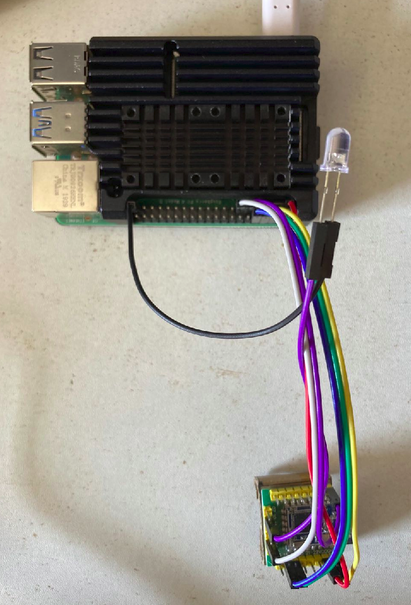

# 智能家居系统项目文档
该项目是从零开始搭建一个接入成本极低的智能家居系统的尝试

## 版本
- [x] V 0.1
主要用于系统通信的验证，接入方式验证，以及家庭常用场景的验证

- [ ] V 1.0
搭建一个可以动态接入的智能家居系统，在网站的后台定义家居产品的类型和功能，app读取后台信息显示对应的控制面板，使用我们的统一通信模块接入待开发产品

## 项目整体说明

在版本 0.1 中，实现的功能有：

1. Android APP 扫码添加模块
2. 统一的后台模块
3. 统一的灯的模块
4. 窗帘模块及机械结构

采用的硬件选型如下：

| 功能         | 硬件选型               | 简单参数                 |
| ------------ | ---------------------- | ------------------------ |
| 主控         | RaspBerry Pi4          | 4G RAM                   |
| 通信模块     | ZigBee                 | 基于CC2530的串口直连模块 |
| 终控         | STM32F103C8T6          | 最小系统板               |
| 光线传感器   | TEMT6000               | 对红外不敏感, 模拟输出   |
| 声音传感器   | MAX9814 或普通         | 模拟输出                 |
| 触摸开关     | TTP223                 | 电容式                   |
| 继电器       | 单路光耦隔离           | 3V3或5V,支持双边沿触发   |
| 窗帘电机     | 42BYGH34-401A 步进电机 | 0.28Nm                   |
| 窗帘供电     | 24V5A直流开关电源      | 220V/110V AC IN          |
| 步进电机驱动 | TB6600                 | 最大可32细分             |

## 主控

主控是采用树莓派加ZigBee的主机模块实现的，其作用是控制多个终端模块，实现WiFi和ZigBee之间通信的网关作用，树莓派上面运行着FastApi的后台，收到来自APP的指令后通过ZigBee模块向终端发送相应指令.

- 接线说明

| raspberry pi     | zigbee host                |
| ---------------- | -------------------------- |
| Pin1 3V3         | VCC                        |
| Pin6 Ground      | GND                        |
| Pin8 GPIO14 TXD  | 17 RX                      |
| Pin10 GPIO15 RXD | 16 TX                      |
| Pin11 GPIO17     | RST                        |
| Pin13 GPIO27     | 13 Mode                    |
| Pin39 Ground     | 10 中间接LED，指示工作状态 |

## 灯模块

灯模块采用stm32和zigbee路由，以及光强度传感器，声音强度传感器以及触摸传感器以及光耦继电器组成，可以接收zigbee主机发送的指令，或者触摸传感器触发家用电灯的亮灭，并有一个全彩LED用于指示触摸传感器的位置，该LED的颜色可由用户调节，在光强较弱是亮起。

- 接线说明

| stm32            | zigbee                         | sensor            |
| ---------------- | ------------------------------ | ----------------- |
| PA9 USART1_TX    | 17 RX                          | -                 |
| PA10 USART1_RX   | 16 TX                          | -                 |
| PB3 GPIO_Output  | 13 Mode                        | -                 |
| PB4 GPIO_Output  | RST                            | -                 |
| GND              | 10 中间接LED，用于指示工作状态 | -                 |
| PB0 PWM          | -                              | 全彩LED R         |
| PB1 PWM          | -                              | 全彩LED G         |
| PA7 PWM          | -                              | 全彩LED B         |
| PA2 ADC2         | -                              | 声音强度传感器 AO |
| PA1 ADC1         | -                              | 光强度传感器 S    |
| PB15 GPIO_Exit   | -                              | 触摸传感器 IO     |
| PB13 GPIO_Output | -                              | 光耦合继电器 IN   |

## 窗帘模块

窗帘控制模块采用stm32,zigbee和42步进电机组成，可以接收zigbee主机发送的指令控制窗帘的开关

窗帘机械结构采用市场上常用的中方轨，设计出与之对应的2个杆子头部的连接件，用于连接窗帘杆和步进电机以及同步带。使用42步进电机和同步带同步轮的方式带动窗帘，其中2个配件的stl文件在3d文件夹下，使用3D打印出成品。

__其中连接件的3D模型如下：__

__打印出成品如下：__

__控制部件如下：__

| stm32           | zigbee                     | microstep driver |
| --------------- | -------------------------- | ---------------- |
| PB6 USART1_TX   | 17 RX                      | -                |
| PB7 USART1_RX   | 16 TX                      | -                |
| PB3 GPIO_Output | 13 Mode                    | -                |
| PB4 GPIO_Output | RST                        | -                |
| GND             | 10 中间接LED，指示工作状态 | -                |
| PA3 GPIO_Output | -                          | ENA+             |
| PA4 GPIO_Output | -                          | DIR+             |
| PA9 PWM         | -                          | PUL+             |
| GND             | GND                        | ENA-             |
| GND             | GND                        | DIR-             |
| GND             | GND                        | PUL-             |

## 指令系统

- 该指令是指有主控向终端发送的命令以及终端向主控的答复
- 每个终端有自己唯一的地址标识符
- 主控每发送一次指令会带上一个递增的指令序号，用于辨别重复接收的指令
- 终端向主控的回令中会附加上所接收指令的序号
### 指令格式

- 主机向终端（定长5）

| 字符1              | 字符2        | 字符3    | 字符4       | 字符5       |
| ------------------ | ------------ | -------- | ----------- | ----------- |
| 接收命令的终端地址 | 该指令的序号 | 具体指令 | 指令附加位1 | 指令附加位2 |

- 终端向主机（不定长，最大128）

| 字符1              | 字符2          | 字符3    | 字符4   | 字符5   | 结束标志 |
| ------------------ | -------------- | -------- | ------- | ------- | --- |
| 发送回令的终端地址 | 接收指令的序号 | 答复值1 | 答复值2 | ... | \| |

### 指令内容

- 设备类型码：

| 编码 | 设备类型 |
| ---- | -------- |
| a    | 主控     |
| b    | 灯       |
| c    | 窗帘     |

- 设备地址码：

目前从a-Z编码，其中主控地址为a

#### 添加新设备

    指令 a: 询问接收到该指令（地址相符）的设备，其识别码是否与指令附加位1相符合，其设备类型是否与指令附加位2想符合
        回令： 答复值1为 T 时确认添加， F或没有回应 确认失败

#### 灯相关

    指令 b: 控制灯的状态，指令附加位1为状态
        回令： 答复值1为 T 动作已近完成， F或没有回应 动作失败
        指令附加位1： a-打开
                    b-关闭

    指令 c: 汇报灯的状态
        回令： 答复值1为工作状态
              a-打开状态
              b-关闭状态

    指令 d: 接收到该指令的设备调整指示灯的颜色，其颜色由指令附加位1指示
        回令： 答复值1为T 时动作完成， F或没有回应，动作失败
        指令附加位1： a-(220, 150, 120)
                    b-(120, 250, 20)
                    c-(60, 160, 160)

    指令 e: 接收到该指令的设备设置场景状态，其场景及场景状态有指令附加位1和指令附加位2确定
        回令： 答复值1为T 时动作完成， F或没有回应，动作失败
              若指令附加位2为c，则答复值2-n a为开启， b为关闭
        指令附加位1： a-设置为进门灯场景
                    b-设置为声控场景
                    c-设置为人体感应场景
                    d-设置为离家场景
                    e-设置为定时场景（需要主控配合）
                    f-设置为自动场景（需要主控配合）
                    z-所有场景
        指令附加位2： a-打开
                    b-关闭
                    c-获取状态

#### 窗帘相关

    指令 o: 控制窗帘状态，指令附加位1指示程度
        回令： 答复值1为T 动作完成， 为F或没有则动作失败
        指令附加位1： a-全部
                    c-0.5
                    e-0

    指令 p: 接收到指令的设备汇报当前的状态
        回令： 答复值1为闭合程度
              a-1
              c-0.5
              e-0

    指令 q: 接收到该指令的设备设置对应场景，其场景和场景状态由指令附加位1和指令附加位2指示
        回令： 答复值1为T 动作完成， 为F或没有则动作失败
              若指令附加位2为c，则答复值2-n T为开启， F为关闭
        指令附加位1： a-进门打开场景
                    b-定时场景（需主控配合）
                    c-自动场景（需主控配合）
                    z-所有场景
        指令附加位2： a-打开
                    b-关闭
                    c-获取状态

## 后台逻辑
后台的架构以及zigbee与http协议的桥接

### 多线程

后台的主线程为FastAPI的线程，用于监听Android端的请求，在FastAPI启动时同时启动串口的监听线程，用于监听串口接收到的数据

每次后台接收到Http请求之后，打开一个新的线程，并在该线程中发送相应的zigbee指令，该指令有一个唯一的指令编码，终端的zigbee回令中带有与之对应的指令编码。在后台发送出zigbee指令后线程开始轮询指令编码对应的标志数组，若串口监听线程接收到对应的指令后会将标志数组中指令编码对应位置的标志改变，轮询的线程检测到标志改变后，做出相应的Http应答，若超时3s，则做出未收到回应的相应的Http应答

其流程如下：

