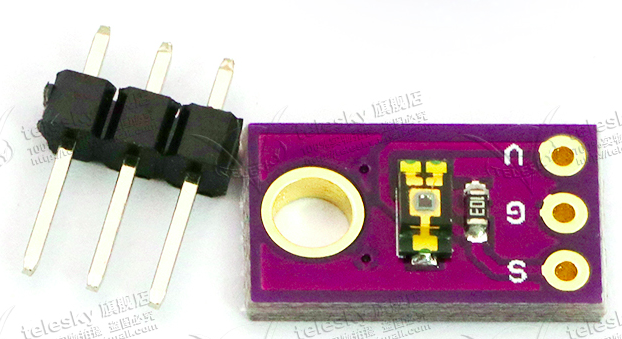
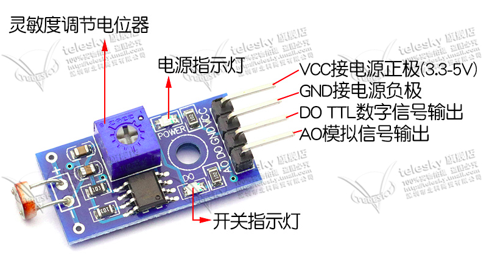
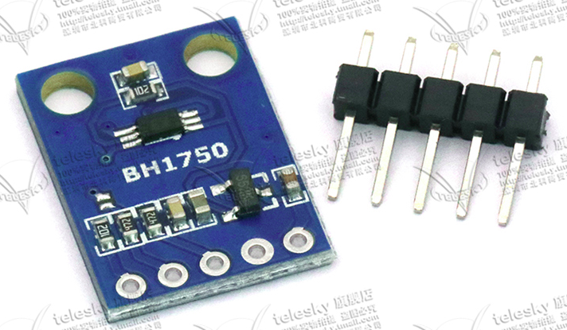
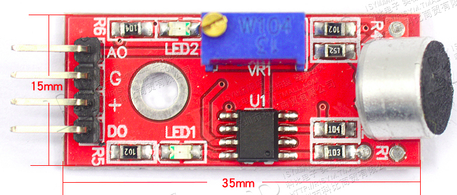
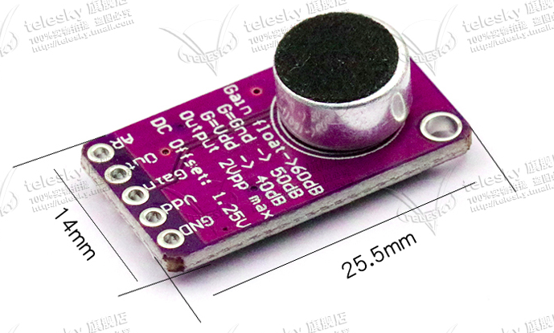
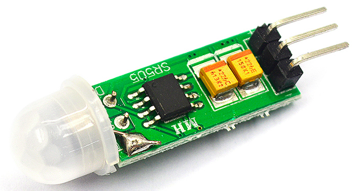
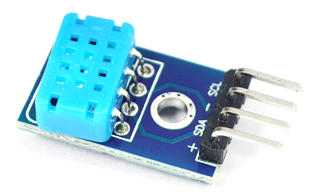
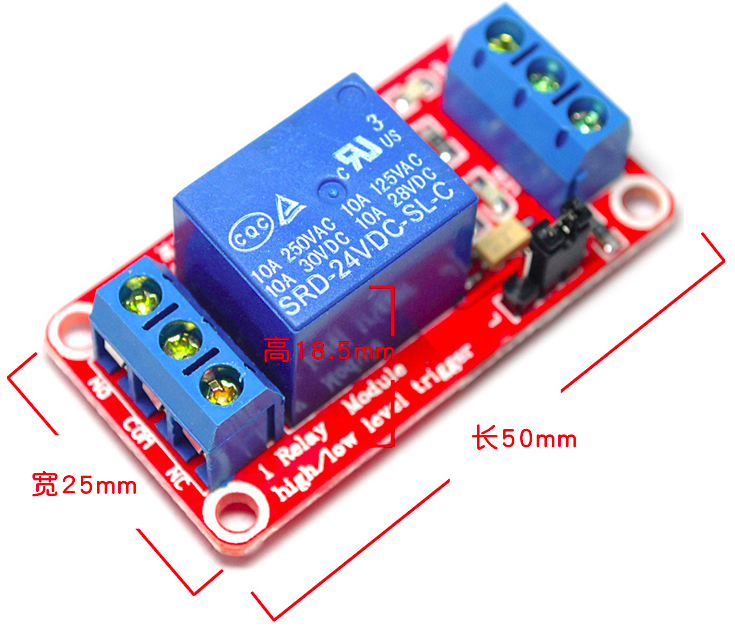

# Sensor

主要有光线传感器，声音传感器，触摸开关，人体传感器，温湿度传感器，光耦继电器

## 光线传感器

- 对环境光敏感，且抑制红外
- S 模拟量输出
- G 接地
- V 电源 1v5-6v 

- 当环境光达到阈值时DO输出低电平，否则输出高电平
- AO可以和AD模块相连
- VCC 电源正极 3v3-5v

- VCC 电源正极3V-5V
- 内置16bitAD转换器，数据范围 0-65535
- I2C通信

## 声音传感器

采用如下模块

- 使用5V直流供电（用于开光处语音信号采集）
- AO 输出实时的模拟量
- DO 当声音的强度达到某阈值时，输出高低电平，灵敏度可通过电位器调节

- 带放大器的声音传感器（用于语音入口）
- Gain 悬空 增益 60dB; VDD 40dB; GND 50dB
- AR 悬空 启动释放比 1:4000； VDD 1:2000; GND: 1:500
- Out 输出

## 人体传感器

选用如下模块

- 使用直流4.5-20V供电
- 输出 高电平3v3;低电平0v
- 感应距离3米
- 延时时间8s
- 可重复触发（在延时时间内保输出高电平，若之间有人体活动则记录并顺延输出）

## 温湿度传感器

选用如下模块：

- 工作电压 2v7-5v5
- 湿度测量范围 20%-95%， 误差 +-5%
- 温度测量范围 0°-50°， 误差 +-2°
- 输出为数字形式
- SDA 串行数据，双向口
- SCL 串行时钟，输入口（单总线时接地）

## 光耦继电器

选用如下模块：

- 常开接口限载， AC250V10A DC30V10A
- 工作电压 5V
- 电源指示灯 绿色； 继电器工作指示灯 红色
- DC+ 接电源正极
- DC- 接电源负极
- IN 控制信号输入，可接GPIO输出
- NO 继电器常开接口
- COM 继电器公用接口
- NC 继电器常闭接口