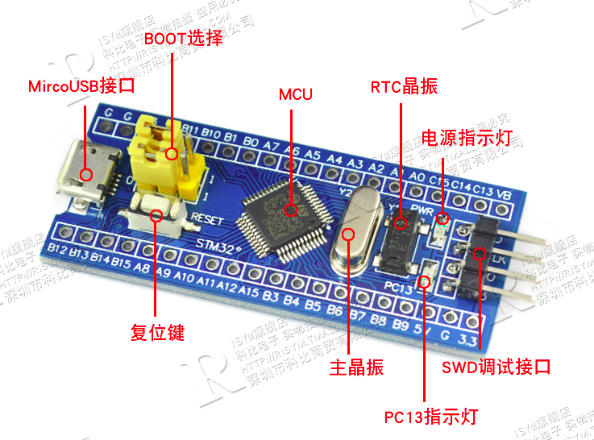
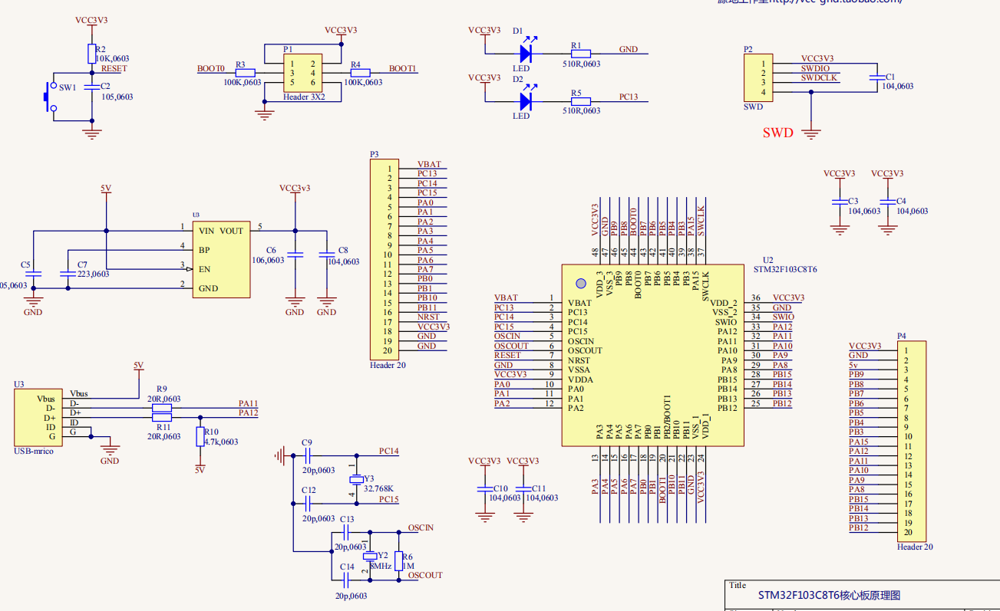

# STM32
采用STM32F103C8T6最小系统板

## 原理图

## 配置

- 最高72MHz工作频率，在存储器的0等待周期访问时可达1.25DMips/MHz, Dhrystone2.1
- 单周期乘法和硬件除法
- 64K Flash
- 20K SRAM
- 2v-3v6供电
- 可编程电压监测器PVD
- 4-16Hz晶振
- 内嵌经出厂调校的8MHzRC振荡器
- 内嵌带校准的40KHz的RC振荡器
- 带校准的32KHz RTC振荡器
- 2个12位AD转换器，1us转换时间，16个输入通道，可转换0-3.6V范围
- 7个DMA控制器，支持定时器，ADC,SPI，I2C和USART
- 37个快速IO口，所有IO可映射到16个外部中断
- 3个16位通用定时器，1个带死区控制和紧急刹车用于电机控制的PWM高级控制定时器，2个看门狗定时器
- 支持SWD和JTAG接口调试
- 2个I2C,3个USART,2个SPI 18M位每秒,一个CAN接口，一个USB2.0接口
- 支持睡眠，停机和待机模式
- VBAT和RTC和后备寄存器供电

