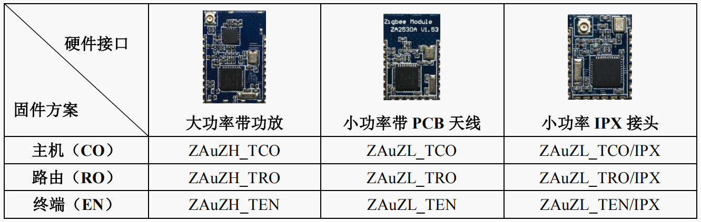
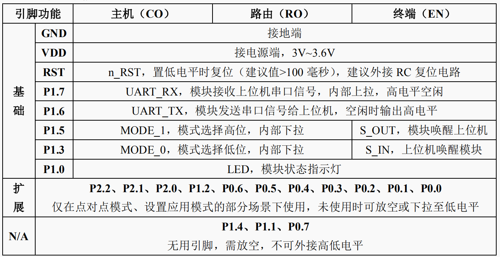
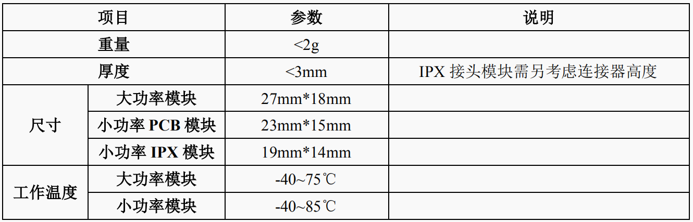
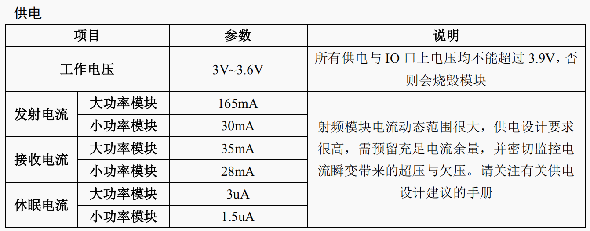
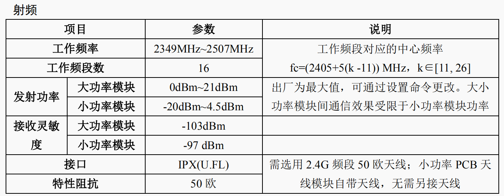
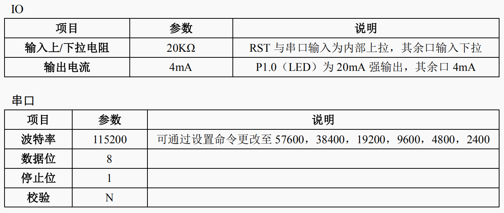
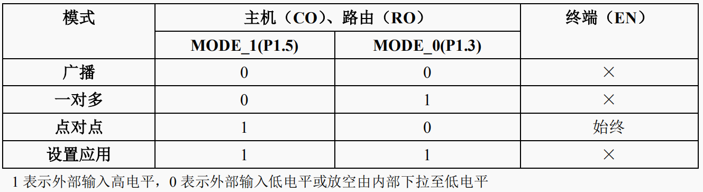

# 选用卓万科技的zigbee串口透传模块
该信息来自于卓万科技的开发文档，在此记录方便查阅，若有侵权，请联系我删除。
## 模块硬件信息

### 模块型号

### 引脚定义

### 引脚功能

### 硬件参数

## 工作模式

分为广播，一对多，点对点模式，这里先采用一对多模式

### 一对多模式

按照如下方式连接

在该模块的实现里，串口数据都是打包为数据包的形式，已近做了数据包的校验，不会出现字节错误丢失的情况，数据包长度为1-80字节。

